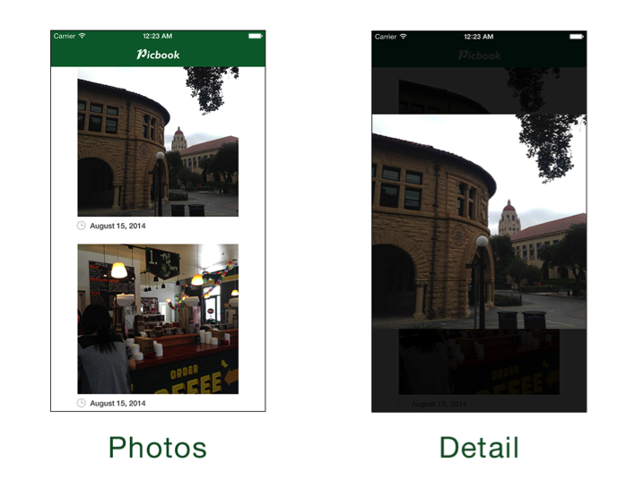

# 305: View Controller Transitions - Lab

## Continuity with Animations

The stock animations in iOS look great, and the simple custom animation that you built in the demo works pretty well too. But when you select an image from the top of the screen or the bottom of the screen, the animation is always the same. 

Wouldn’t it be nice for the animation to make it feel like the image is popping up right from where you tapped it?

In this short challenge, you will make the presentation animation originate from the photo that you tapped, as well as give the animation a spring so it feels more organic.

## Lab: Make Me Pretty

In order to get your transition to look like the photo is just getting larger and the background is fading, you should understand how to set the problem up. Frequently when building custom transitions, you will need to do a little planning before diving into code.

Take a quick look at the before and after for both PhotosController and PhotoDetailController: 

 
Notice how in the `PhotosController` view that the image that was selected (the first one) is up near the top of the scene. In the `PhotoDetailController` view, the selected image is centered. Currently the Transitions project does all of this already, but how could you animate the transition between states.

The key to getting this transition right is to know the frame of the photo in the before state and the after state.

 
You are probably pretty used to using `CGRects` and `CGPoints` to layout and move views around the screen before. You will need to be able to determine the frame of the photo view relative to the screen when the transition **starts** and **ends**.

The only caveat is that when architecting your controllers you really don’t want different controllers knowing a lot about each other’s state, views, etc. This is where `UIViewControllerTransitionDelegates` really come into play. 

In the project **Transitions.xcodeproj** from the previous demo, open the file **PhotosController.swift**. Near the top of the PhotosController class, add a couple variables:

    var selectedView: UIView?
    var selectedViewOriginRect = CGRect.zeroRect

The `selectedView` variable will hold a view that a transition coordinator can use to show, hide, or get information from. The `selectedViewOriginRect` variable will be a quick access point for your transition coordinator to figure out where to start the animation.

Find the function `collectionView:didSelectItemAtIndexPath:` near the end of the file. Just before setting up the destination controller, add the following:

    // 1
    if let cell = collectionView.cellForItemAtIndexPath(indexPath) as? PhotoCell {
      // 2
      selectedView = cell.photoImageView
      // 3
      selectedViewOriginRect = cell.contentView.convertRect(cell.photoImageView.frame, toView: view)
    }

1.  Just to be safe (and to make the Swift compiler happy), only proceed if you actually have a `UICollectionViewCell` to use.
2.  Set the `selectedView` to the `photoImageView` of the cell. Remember that you only want to animate the photo, not the clock icon or the date label.
3.  Find the frame of the `photoImageView` relative to the actual view. This uses the `convertRect` function on the current `UICollectionViewCell`. Remember that the `photoImageView`’s frame is currently relative to it’s superview, the cell’s contentView.

To actually implement the animation, open **FullscreenPresentationAnimator**.swift. In the **animateTransition:** function, erase any previous animations so that the function looks like this:

    func animateTransition(transitionContext: UIViewControllerContextTransitioning) {
      let to = transitionContext.viewControllerForKey(UITransitionContextToViewControllerKey)! as PhotoDetailController
      let from = transitionContext.viewControllerForKey(UITransitionContextFromViewControllerKey)! as PhotosController
      let container = transitionContext.containerView()
      let duration = transitionDuration(transitionContext)

      container.addSubview(to.view)
    }

At the bottom of the **animateTransition:** function, add the following:

    let toFrame = to.imageView.frame
    to.imageView.frame = from.selectedViewOriginRect

This small snippet captures the current frame of the `imageView` of the `PhotoDetailController`. You will use this frame as the final resting spot for the animation. Next, you set the imageView frame to that of the selected PhotosController view.

Add another block of code beneath the code you just added:

    UIView.animateWithDuration(duration,
      delay: 0,
      usingSpringWithDamping: 0.6, // 1
      initialSpringVelocity: 0.2,
      options: .BeginFromCurrentState, // 2
      animations: {
        // 3
        to.imageView.frame = toFrame
      }, completion: { finished in
        // 4
        transitionContext.completeTransition(!transitionContext.transitionWasCancelled())
    })

1.  You are using a spring animation for this transition now. Both damping and velocity should be values between 0.0 and 1.0. For this animation, the view has medium dampening and little initial velocity for a smooth effect.
2.  Begin the animation from wherever the view currently is, just in case there are any orientation or other animations in flight.
3.  Simply set the `imageView` frame to the frame it had when the view was loaded. This makes your code a bit more reusable and DRY. The transition coordinator doesn’t actually care what the final resting frame is.
4.  Perform your post-transition cleanup. You should have seen this line previously in the demo. Remember that you **always** tell the transitioning context that the transition is finished. Also, using `transitionWasCancelled` is a good practice to get used to.

>Note: Typically you would call `removeFromSuperview` on the from controller’s view in the completion block. However, since you are using an overlay transition, you want to keep the from controller’s view in the scene, otherwise the background would go black after the transition finishes. 

**Build and run** your app and tap on a photo to see your transition!

 
You might notice a kind of jarring effect. The background of the transition immediately pops into view. It would be much more pleasing on the eyes if the background actually faded in.

Still in **FullscreenPresentationAnimator.swift**, add the following to the very end of **animateTransition:**

    // 1
    let bgColor = to.view.backgroundColor
    to.view.backgroundColor = UIColor.clearColor()

    // 2
    UIView.animateWithDuration(duration * 0.2, animations: {
      to.view.backgroundColor = bgColor
    })

1.  Capture the current background color and then set the current color to clear. This pattern is exactly the same as when you captured the `imageView` frame before animating it.
2.  Animate the background color in but do it in 20% of the time that the total animation will take. This way the dark background will contrast the animating photo and give it more focus.

**Build and run** to see your new subtle background fade!

There’s one more nitpicky thing that you could do to make the app feel even more immersive. If you haven’t noticed yet, you can actually still see the image that you are animating into scene. This takes you out of the transition a little because you are immediately aware that you are looking at a copy of the view, not the actual one that you tapped on.

 
Add a single line to the end of **animateTransition:**

    from.selectedView?.hidden = true

This one-liner just hides the `selectedView`. Since you are animating the `imageView` and it’s frame is being set to that of the `selectedView` before the animation starts, the `imageView` will *cover up* the hidden space.

**Build and run** and notice how it looks like the photo is actually popping right up under your finger tips! You might notice that dismissing the photo leaves a blank space, you’ll take care of that in the Challenge.

Congratulations! You have just finished the lab portion of the View Controller Transitions session. Feel free to move on to the Challenge, play around with the rest of the project, or just hang tight until the Challenge portion of the session begins.
