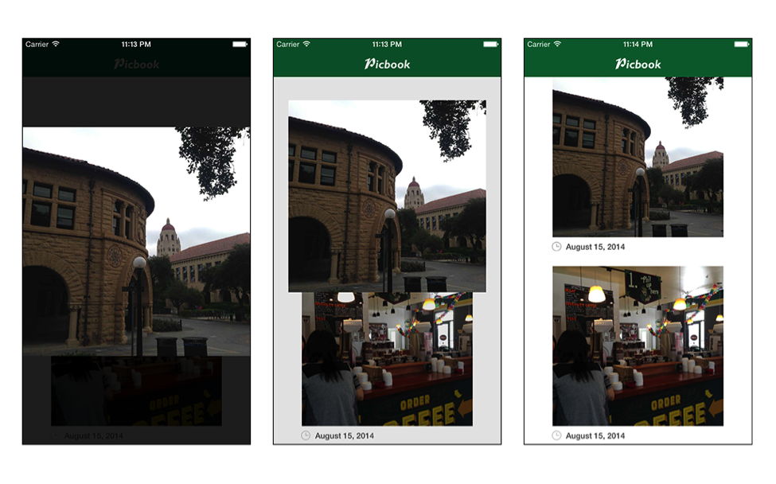

# 305: View Controller Transitions - Lab

## Challenge: On The Right Track!

You may have noticed that whenever you dismiss a photo, it leaves a big white blank whole where the photo originated from. Also, there really isn’t any nice dismiss animation to compliment your new presentation animation. You’re going to add all of this right now!

Open **FullscreenDismissAnimator.swift** and find the **animateTransition:** function. This is the exact same function that you were working on in `FullscreenPresentationAnimator` except you are going to be adding the dismiss animation now.

In the animateTransition: function, use the transitionContext to get the following transition properties:

- The to controller
- The from controller
- The animation duration

    func animateTransition(transitionContext: UIViewControllerContextTransitioning) {
      // TODO...
    }

You will need to cast the **to** and **from** controllers to their appropriate classes so you can get details about where to animate your views. Make sure to pay attention to your **view controller keys** and which classes you assign them to.

After you have the duration of the animation, add in the following, create a UIView spring animation that has the following properties:

- Spring damping of **0.7**
- Initial spring velocity of **0.2**
- Animation should begin from the **current state**

Just like in the Lab, you need to animate the state from one controller to another and then perform any cleanup. Try filling in the animation block by using the diagram below, and if you get stuck, refer back to the work you did in `FullscreenPresentationAnimator`. 

 
In the animation completion block, do some additional cleanup to make sure that the from controller’s view is no longer loitering and to make sure that the image is visible when the animation finishes.

    UIView.animateWithDuration(duration,
      // ...
      }, completion: { finished in
        // your code...
        to.selectedView?.hidden = false
        from.view.removeFromSuperview()
    })

The last thing that you need to do is make sure that you have a nice, smooth background fade along with the photo dismiss animation. Add this animation somewhere in **animateTransition:**. 

Again, if you get stuck refer back to your background animation in `FullscreenPresentationAnimator`.

**Build and run** your app, open a photo, then tap or drag and release to dismiss it to observe your fancy new transition animation! It should look something like the sequence below.

